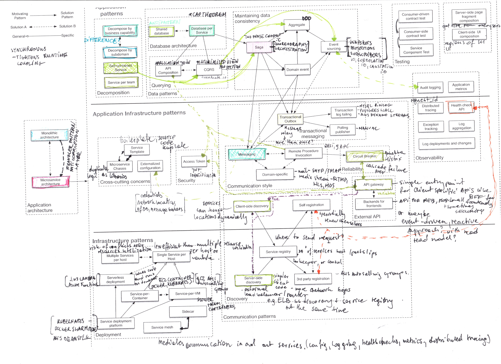

# Init

## Sources

1. https://martinfowler.com/microservices/
2. https://microservices.io/index.html
3. http://chrisrichardson.net/post/microservices/general/2019/02/16/whats-a-service-part-1.html
4. https://microservices.io/microservices/news/2018/02/20/no-such-thing-as-a-microservice.html

Plan:

1. Cutting and team sociology:
    * https://event-driven.io/en/sociological_aspects_of_microservices/ (Conway law)
    * https://event-driven.io/en/how_to_cut_microservices/
    * https://www.youtube.com/watch?v=haejb5rzKsM
2. Fowler thoughts: https://martinfowler.com/microservices/
   * Definition - https://martinfowler.com/articles/microservices.html
   * Trade-Offs - https://martinfowler.com/articles/microservice-trade-offs.html#boundaries
   * When to do? Monolith first? vs Dont start with monolith 
   * Prerequisites (Rapid provisioning, monitoring, rapid app deployment, devops culture) & first law of distributed objects
   * Testing
   * Breaking monolith (https://martinfowler.com/tags/legacy%20rehab.html)
   * Frontend
   * InfrastructureAsCode, DevOps
3. When To Use Microservices - https://www.youtube.com/watch?v=GBTdnfD6s5Q 
   * activity/tech over outcome/benefit
   * monolith also can be distributed
   * try one, not all at once
   * isolation of processing data, zero downtime, high degree of autonomy (deploys take to long, we have a queue of people wanting to deploy sth a day before), reducing risks of deployment, enabling canary releases
   * information hiding
   * "there is nothing more complicated than distributed system"
   * monolith - we find ways to violate isolation, microservices prevent that (in very crooked way but still). nothing above class to defend modularity (in code by default)
   * handling data - relation between data is sometimes more obious than in code and better express intent and domain, after separation of code we need to acknowledge what kind of data it uses from old db
   * handling data - maybe one db and multiple schemas? 
   * handling data - consistency bye bye - but normally we do not need transaction through whole db, we have specific processes
   * people need to want change, Kotters 8 step process for making organizational change https://whatfix.com/blog/kotters-8-step-change-model/
   * "governance through tooling"
4. Patterns: https://microservices.io/patterns/index.html
    * Application architecture patterns
        * Monolithic architecture - https://microservices.io/patterns/monolithic.html
        * Microservice architecture - https://microservices.io/patterns/microservices.html
    * Decomposition
    * Refactoring to microservices
    * Data management
        * Transactional messaging
    * Testing
    * Deployment patterns
    * Cross-cutting concerns
    * Communication patterns
        * Style
        * Service discovery
        * Reliability
    * Security
    * Observability
    * UI patterns
   
5. Refactoring
    * https://microservices.io/refactoring/index.html
6. Microservices adoption anti-patterns: 
    * http://chrisrichardson.net/post/antipatterns/2019/01/28/melbourne-microservices.html
    * https://microservices.io/microservices/antipatterns/-/the/series/2019/06/18/microservices-adoption-antipatterns.html\
7. Scale cube - https://microservices.io/articles/scalecube.html
8. Testing strategies - https://martinfowler.com/articles/microservice-testing/
   
1.2
When worth having more than one deployment unit in application?
Difference in trafic and workload in indivicual parts of app. Increasing throughput (BF), multi tenancy, multiregion
Not? 100% availability, microservice per storage type xD

1.3
Team cognitive load - how well do you understad system you work with? Missing skills or capabilites?
Team Interaction patters - collaboration, x as a service, facilitating? How would teams react?
Is your Platform well defined? 
Team Topologies (book)

Additional
https://martinfowler.com/bliki/SacrificialArchitecture.html
https://martinfowler.com/bliki/ServiceOrientedAmbiguity.html
